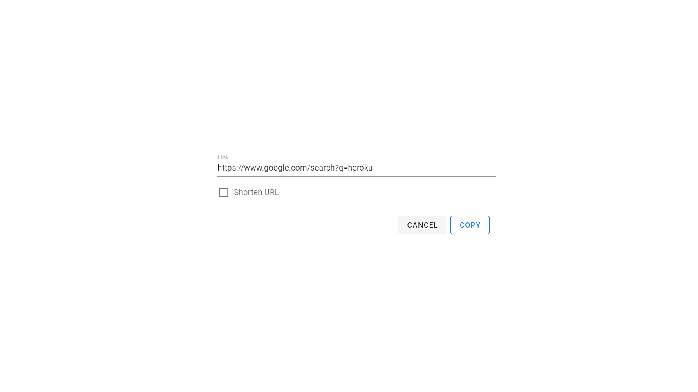

# URL shortener

## Project URL

https://fun-size.herokuapp.com/

## Description

```
Make long URLs fun size. Enter any url to make it tiny.
```

## Screenshot



## Build Setup

```bash
# install dependencies
$ npm install

# serve with hot reload at localhost:3000
$ npm run dev

# build for production and launch server
$ npm run build
$ npm run start

# generate static project
$ npm run generate
```

For detailed explanation on how things work, check out [Nuxt.js docs](https://nuxtjs.org).
